## Agradecimentos
Os dois cadernos Jupyter foram gentilmente cedidos pelo aluno **Felipe Curcio**, que trabalha com um problema muito similar para o TCC 2. Ele forneceu os dois cadernos sobre a biblioteca de análise, slogo no início. Isso direcionou o projeto e permitiu avanços. Também houve com ele uma discussão sobre o uso de outros possíveis métodos, tais como SHAP, mas infelizmente não foi possível fazê-los funcionar por conta dos problemas e limitações explicados nesse relatório. O segundo caderno, o mais relevante para as análises, não acompanhou um dataset que permitiu a modificação dos parâmetros, o que foi um fator limitante, mas não impediu a progressão dos fatos.

O aluno **Raul Gomes de Martino** despendeu um esforço admirável para o progresso deste trabalho, que, sem ele, não teria se concretizado. Houveram diversos empecilhos para a análise de features, e ele gentilmente cedeu seu tempo e esforço mental para mitigá-los. Não somente orientou quanto aos aspectos técnicos do trabalho como forneceu insights criativos sobre a maneira a qual a análise poderia ser melhor conduzida. Além disso, realizou várias chamadas que auxiliaram na compreensão de como aspectos fundamentais do STConvs2S funcionam.

Um grande obrigado a ambos pela ajuda!

## Sobre o STConvs2S
O STConvS2S (Spatiotemporal Convolutional Sequence to Sequence Network) é um modelo preditivo espaço-temporal projetado para tarefas de previsão de múltiplos passos. Trata-se de uma arquitetura baseada em Redes Neurais Convolucionais 3D (3D CNN), concebida como um modelo treinável de ponta a ponta para previsão de séries temporais com dependências espaciais e temporais. O desenvolvimento do STConvS2S seguiu um ciclo de vida típico de projetos de aprendizado de máquina: seleção e preparação dos dados (utilizando os conjuntos CFSR e CHIRPS), criação e treinamento do modelo, e avaliação dos resultados. Para avaliação, foram utilizadas as métricas RMSE (Root Mean Squared Error) e MAE (Mean Absolute Error), que quantificam o erro das previsões em relação aos valores reais.

O principal objetivo do STConvS2S é superar duas limitações intrínsecas dos modelos baseados em CNN para tarefas de previsão de séries temporais: a violação da ordem temporal (restrição causal) e a incapacidade de gerar uma sequência de saída mais longa que a sequência de entrada.

Para resolver essas questões, o STConvS2S introduz duas contribuições principais:
1.  **Tratamento da Restrição Causal**: Propõe duas variantes para garantir que a ordem temporal seja respeitada. Uma adapta a convolução causal em camadas convolucionais 3D, e a outra introduz uma nova abordagem que aplica estrategicamente uma função de reversão na sequência, permitindo que o modelo respeite a ordem temporal mesmo sem o uso de recorrência.
2.  **Geração de Sequências de Saída Flexíveis**: Apresenta um "bloco gerador temporal" que utiliza camadas convolucionais transpostas para estender o comprimento da sequência de saída, permitindo previsões com um horizonte de tempo maior que os dados de entrada.

Nos experimentos realizados, o STConvS2S foi aplicado à previsão de variáveis meteorológicas e comparado com modelos de última geração (ConvLSTM, PredRNN e MIM). Foram testadas diferentes configurações de hiperparâmetros (número de camadas, filtros e tamanho do kernel) para analisar o desempenho e a eficiência do modelo. Os resultados indicam que as variantes do STConvS2S, especialmente o STConvS2S-R (com a abordagem de reversão), demonstraram ser significativamente mais eficientes em termos de tempo de treinamento e uso de memória, além de alcançarem um desempenho superior ou comparável em termos de precisão. 
Por exemplo, na tarefa de previsão de temperatura com o dataset CFSR, o STConvS2S-R (versão 4) utilizou apenas 1/4 da memória, foi quase 5x mais rápido no treinamento e obteve uma melhora de 23% no RMSE em relação ao melhor modelo RNN comparado (MIM). Além disso, a arquitetura permite paralelização total do treinamento, pois as saídas das camadas convolucionais não dependem de etapas anteriores, ao contrário das arquiteturas recorrentes.

Esses resultados reforçam que o STConvS2S é uma alternativa promissora para tarefas de previsão espaço-temporal, podendo ser aplicado em diferentes domínios além da meteorologia. O modelo é flexível, eficiente e capaz de capturar dependências complexas em dados espaço-temporais, sendo uma contribuição relevante para a área de previsão de séries temporais com múltiplos passos.

## Problemas e limitações para execução local

A **AUSÊNCIA DE ACESSO AO SERVIDOR DO STConvs2S** foi um fator tão impeditivo que poderia ter impedido a execução do trabalho. Não havia como carregar o dataset para a execução na máquina pessoal deste autor, que contava com somente 16GB de memória RAM quando foi incumbido da tarefa. Este, ainda, despendeu um valor significativo para adquirir memória no centro da cidade, na esperança de que seu humilde laptop fosse suportar a carga de trabalho; pasmem: de nada adiantou, pois o referido laptop só suportava dois pentes para sua surpresa. Ao retirar 8GB para a melhoria, ganhou apenas 8GB. Quis fazer melhor, mas o orçamento foi um problema. **Seria muito mais simples com este acesso**.

De certa maneira, essa questão foi a fonte de praticamente todos os outros. Agora, antes da explicação de cada problema, é essencial mencionar que o aluno **Raul** cedeu datasets completos de treinamento e arquivos de pesos do modelo, dentre outras coisas. O primeiro dataset cedido contava com mais de 14GB de dados. Os arquivos .pth.tar cedidos correspondiam à informação de pesos do modelo já treinado. Contextualizar isso é necessário para compreender os problemas que serão explicados, bem como o restante do relatório.

O primeiro erro foi, de forma surpreende, logo na primeira tentativa de execução com o dataset. Aparentemente há uma incompatibilidade entre a versão utilizada no servidor e utilizada na computador pessoal. Esse foi um problema difícil de se entender e compreender, o que atrasa naturalmente o objetivo final.
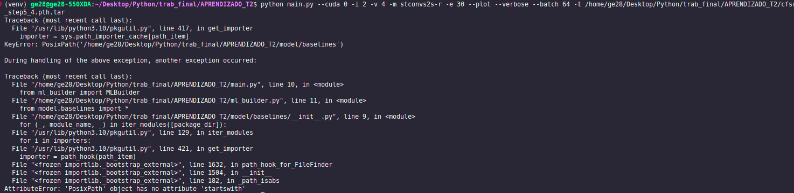

A resolução era inacreditavelmente simples: mudar um trecho mínimo nos inits das pastas ablation e baselines.
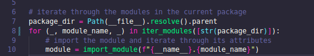
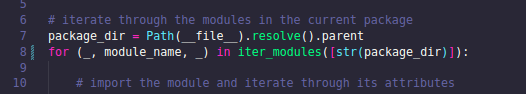

Então, o segundo problema foi identificado: cada passo de treinamento, e mesmo execução, do STConvs2S exige que o dataset seja carregado em memória. Apesar da tentativa de rodar o modelo já fornecendo o arquivo de pesos, temos esse pequeno inconveniente:
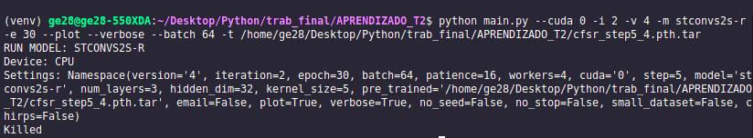

Conforme mostra a imagem acima, mesmo sem realizar o treinamento do zero, não é possível fazer qualquer coisa com o modelo usando o dataset fornecido, porque a memória do computador pessoal não é suficiente.

Isso foi resolvido através de um dos arquivos criados para o projeto: [slicer](slicer.py). Através dele foi possível construir um dataset otimizado, mantendo as propriedades originais, mas reduzindo o número de amostras presentes radicalmente. Naturalmente, essa redução prejudica qualquer análise mais aprofundada no dataset real, por isso, a análise de features foi feita de modo a permitir que o modelo e o dataset reais possam ser usados no servidor, enquanto o computador pessoal precisa das versões reduzidas. Entender essa limitação consumiu um grande tempo do projeto em si, e envolveu muitas outras modificações que foram realizadas, mas eventualmente desfeitas porque não resolveram a questão; somente com a criação de um dataset reduzido foi possível avançar.

O terceiro problema foi após a obtenção de um dataset reduzido. Mesmo tendo o par correto de pesos resultantes de treinamento e dataset para treinamento, houve alguma incompatibilidade em relação às dimensões. Aparentemente o dataset tinha 8 canais, e a versão do modelo 5. 
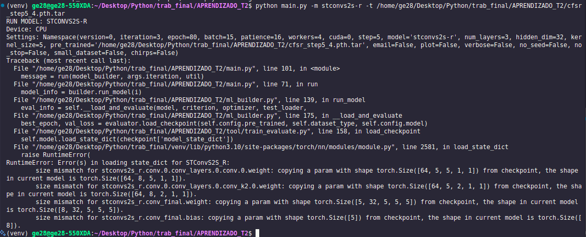

Foi um estranho problema, impossível de se apurar no curso deste projeto. A solução encontrada foi treinar, já em ambiente local, um modelo com o dataset reduzido, corrigindo também problemas de compatibilidade. Esta é uma outra solução que piora a qualidade da análise; por isso, fica aqui mais uma vez reforçada a necessidade de executar novamente a análise de features no servidor adequado.

O quarto problema foi relacionado à função que gera uma imagem para a visualização da amostra; essa imagem mostra o tensor de precipitação correto, um canal das features e o tensor previsto pelo modelo. No entanto, a função não estava preparado de modo algum para exibir múltiplos canais na imagem, o que gerava um erro ao tentar executar o arquivo **main.py**. 
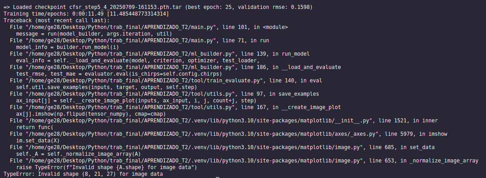

Foi feita uma adaptação; agora, todos os canais eram exibidos, para x, y e valores preditos, conforme mostra a imagem de exemplo abaixo. O erro também foi corrigido, e finalmente foi possível executar a função **main.py**.
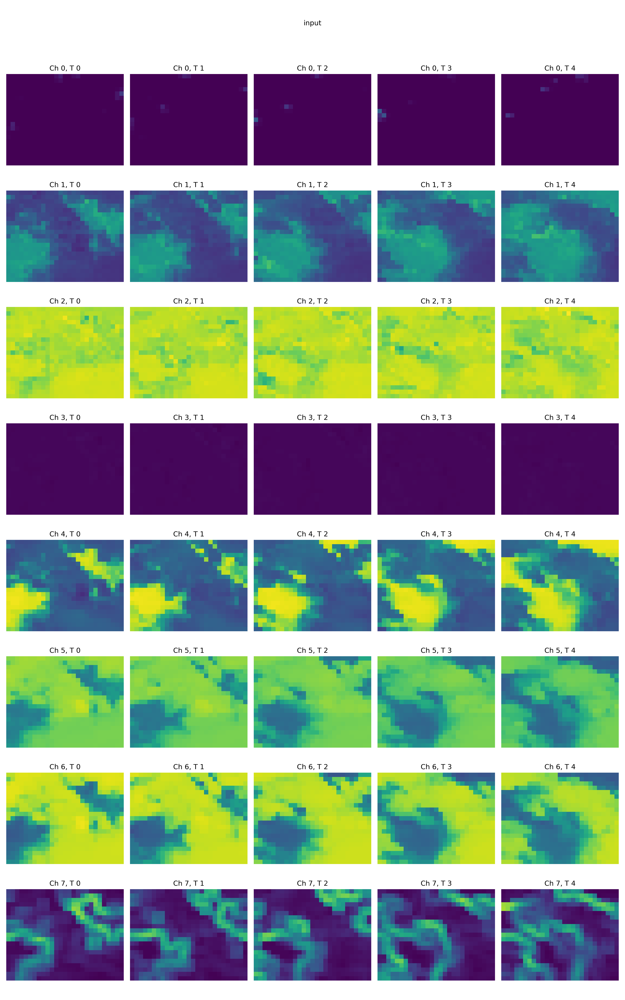

O próximo problema é também importante para todos os demais autores que trabalharem com o STConvs2S. Em teoria, é necessário replicar a informação de saída para todos os canais, tornando x e y de mesmas dimensões. Porém algumas suspeitas levaram à criação do arquivo [check_channel_repeats](check_channel_repeats.py), que confirmou que, por alguma razão, boa parte das amostras possui valores de y diferentes em cada canal. 
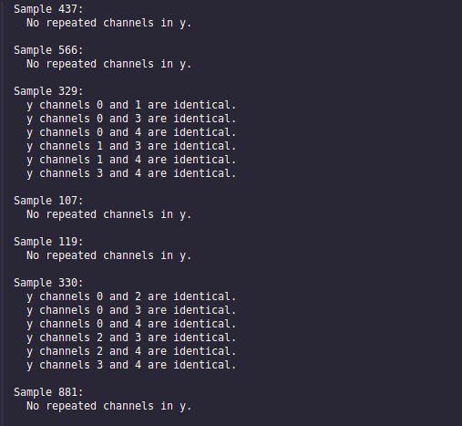

Considerando isso, ao invés de escolher um canal de y, a média deles determinou o target analisar as features.

Por último, como estava sem acesso ao servidor, não foi trabalhar com todas as modificações do STConvs2S feitas. Depois de algum tempo de trabalho, o aluno **Raul** esforçou-se para commitar o máximo de mudanças em seu fork do projeto no GitHub, para colaborar com este projeto. Além do commit obviamente não incluir tudo, foram necessários alguns ajustes para o código voltar a funcionar corretamente após. Desnecessário dizer que foi um trabalhado causado unicamente pela ausência de acesso ao servidor.

## Limitações de processamento dos métodos

Assim como informado na seção de problemas encontrados, a grande maioria dos scripts não pode executar sob o dataset completo. Isso se estende inclusive para a análise de features. Limitamos o conjunto a ser analisado para ter tamanho 10, ou seja, a importância é calculada somente para 10 amostras. Isso é algo a ser ajustado na execução no servidor. Além disso, os caminhos corretos dos pesos treinamentos e do dataset precisam ser informados para alguns scripts.

## Por que precisamos cortar o dataset e treinar o modelo localmente?

Em resumo, a necessidade de cortar o dataset e treinar o modelo localmente decorre principalmente das limitações de hardware e acesso enfrentadas durante o desenvolvimento deste trabalho. Como já dito, a ausência de acesso ao servidor do STConvs2S e a limitação de memória RAM no computador pessoal impossibilitaram o uso do dataset completo e dos pesos originais do modelo. Mesmo após tentativas de upgrade de hardware, não foi possível carregar o conjunto de dados integral nem executar o modelo com os arquivos fornecidos. Por isso, foi imprescindível criar versões reduzidas do dataset, permitindo que as análises e experimentos fossem realizados localmente, ainda que de forma limitada. Ressalta-se que esta é uma solução paliativa, e a análise ideal deve ser refeita no ambiente de servidor adequado, com os dados completos e recursos computacionais apropriados. Muitos detalhes e exemplos dessas dificuldades já foram apresentados nas seções anteriores deste relatório.

## Arquivos envolvidos
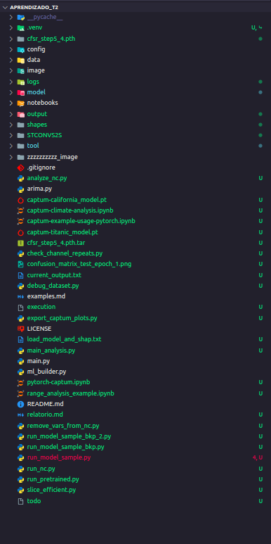
Conforme mostra a imagem acima, foi necessário criar muitos arquivos para compreender a estrutura do repositório STConvs2S. Muitos deles foram descontinuados, mas o projeto em si envolveu muita análise de muitos aspectos do código. Cada um dos arquivos mantidos representa alguma necessidade para a pontuação da importância das features, de forma indireta ou não.

A seguir, algumas explicações básicas do propósito de cada um:

O arquivo [captum-example-usage-pytorch](captum-example-usage-pytorch.ipynb) é um caderno genérico sobre o uso da biblioteca Captum, que utilizamos aqui para fazer uma análise da importância das features na capacidade preditiva.

O arquivo [pytorch-captum](pytorch-captum.ipynb) é mais focado para nosso problema atual. Ele usa um conjunto de dados muito similar ao que abordamos nesse projeto. Os dois foram fornecidos pelo aluno **Felipe**.

[ablation/__init__.py](model/ablation/__init__.py) e [baselines/__init__.py](model/baselines/__init__.py): primeiros arquivos a exigirem mudança. Na forma como estavam, não permitiam a execução do código na versão do Python utilizada no computador pessoal.

[slicer](slicer.py): O Slicer permitiu a criação de datasets reduzidos para avançar com o trabalho. Ele mantém todas as propriedades do arquivo original, reduzindo somente a quantidade de amostras. Ele não é genérico de forma alguma: só funciona para o dataset no formato atual, qualquer modificação pode impedir seu funcionamento. Conforme discutido neste relatório, não foi possível realizar qualquer avanço com o dataset original em um computador pessoal.

[check_channel_repeats](check_channel_repeats.py): Este arquivo confirmou suspeitas ao verificar que as informações não estavam plenamente idênticas para os valores de y do dataset. Essa replicação não exata provavelmente afeta significativamente o treinamento, e merece alguma verificação.

[tool/utils.py](tool/utils.py): Contém uma classe de utilitários (`Util`) com diversas funções de apoio para os experimentos. É responsável por tarefas como plotar gráficos de perdas, salvar os resultados dos modelos, enviar notificações por e-mail ao final da execução, gerenciar diretórios de saída e checkpoints, e visualizar os tensores de entrada e saída como imagens. Foi modificado para exibir múltiplos canais nas imagens de exemplo, corrigindo um erro que impedia a execução do script principal.

[analyze_nc.py](analyze_nc.py): Este arquivo exibe informações do dataset, inclusive quais canais estão presentes. Foi essencial para manter diversas versões do dataset e assegurar que os cortes não prejudicaram seu formato: 
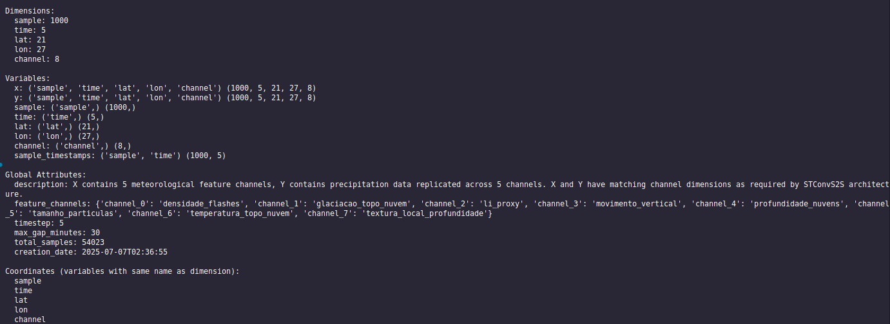 

[run_model_sample.py](run_model_sample.py): Produto principal deste trabalho.

## Análise de Features

A estrutura do projeto foi amplamente baseada em scripts já existentes no repositório STConvS2S, especialmente no arquivo `main.py`. A configuração de argumentos, o gerenciamento de dispositivos (CPU/GPU), a definição de seeds para reprodutibilidade e a sequência de execução (carregamento de dados, criação do modelo, avaliação) seguem o padrão estabelecido pelo código original. A classe `Config` utilizada neste projeto replica a estrutura de argumentos do script principal, mantendo compatibilidade e facilitando a integração com os demais módulos.

O processamento dos dados, incluindo o carregamento de arquivos NetCDF, a divisão em conjuntos de treino, validação e teste, e as transformações de normalização, foi reaproveitado do arquivo `ml_builder.py`. O uso da classe `NetCDFDataset` e das rotinas de normalização por canal (com `MinMaxScaler`) garantem que os dados estejam no formato adequado para o treinamento e avaliação dos modelos, mantendo a fidelidade ao pipeline original.

A organização dos diretórios de saída, o salvamento de exemplos e a gestão de metadados temporais foram herdados da classe `Util` presente em `utils.py`. Essa reutilização permitiu manter a padronização dos nomes de arquivos, a estrutura hierárquica das pastas e a facilidade de localização dos resultados gerados. A avaliação dos modelos, incluindo o carregamento de checkpoints, o cálculo de métricas (RMSE, MAE) e o suporte a transformações `log1p`, foi baseada na classe `Evaluator` de `train_evaluate.py`. As funções de perda, como `RMSELoss`, foram utilizadas diretamente de `loss.py`, assegurando consistência com os experimentos originais.

As arquiteturas dos modelos STConvS2S (causal e reversa) foram importadas sem modificações de `stconvs2s.py`, e os parâmetros padrão seguiram as configurações validadas nos notebooks de referência. Os padrões de execução e avaliação também foram extraídos desses notebooks, garantindo que as análises realizadas sejam comparáveis às do repositório original.

O projeto utiliza bibliotecas já presentes no repositório, como Scikit-learn e XArray, e integra de forma inédita a biblioteca Captum para interpretabilidade de modelos.

## Abordagem

A análise de importância de features, implementada no arquivo `run_model_sample.py`, utiliza o método **Integrated Gradients (Gradientes Integrados)** da biblioteca `Captum` para atribuir as previsões do modelo às suas features de entrada. A análise é segmentada por **faixas de precipitação**, permitindo uma avaliação mais detalhada do comportamento do modelo em diferentes cenários:

*   **0-5mm** (precipitação leve)
*   **5-25mm** (precipitação moderada)
*   **25-50mm** (precipitação pesada)
*   **50+mm** (precipitação muito pesada)

Para cada uma dessas faixas, o script calcula e gera visualizações para três tipos de importância:

1.  **Importância de Canal (Feature Importance)**: Calcula a contribuição média de cada canal de entrada (ex: "densidade_flashes", "temperatura_topo_nuvem") para as previsões. O resultado é um gráfico de barras que compara a influência de cada feature.
2.  **Importância Espacial (Spatial Importance)**: Calcula a importância de cada ponto na grade de latitude e longitude. O resultado é um mapa de calor que mostra as áreas geográficas mais influentes para o modelo.
3.  **Importância Temporal (Temporal Importance)**: Calcula a importância de cada passo de tempo na sequência de entrada, revelando quais momentos no passado são mais relevantes para a previsão. O resultado é um gráfico de barras que ilustra a importância de cada passo de tempo.

Essa abordagem multifacetada detalha **o quê** (canais), **onde** (espaço) e **quando** (tempo) é mais importante para o modelo, e como essas importâncias mudam com a intensidade da precipitação.

Abaixo, um exemplo da importância temporal para a faixa de 5-25mm.
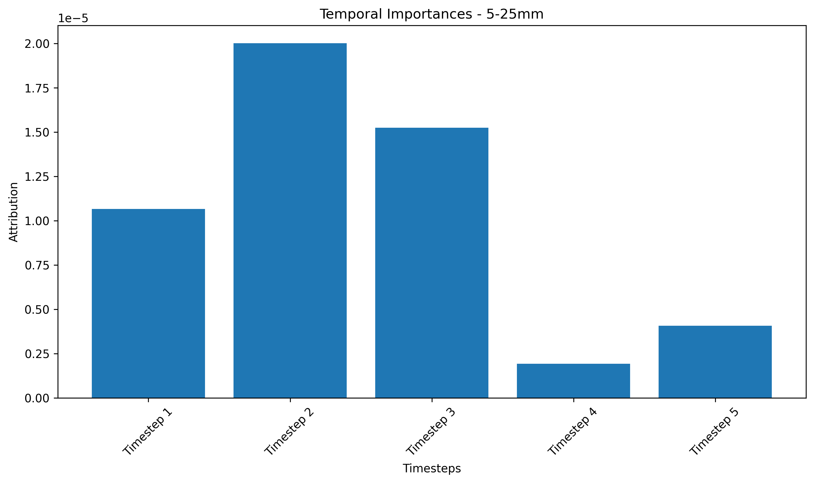

A seguir, a importância espacial para a faixa de 0-5mm.
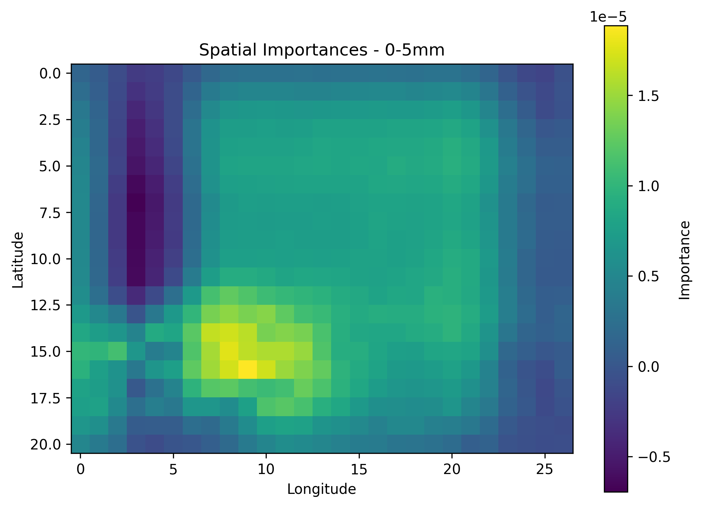

Por fim, a importância de cada feature para a faixa de 0-5mm.
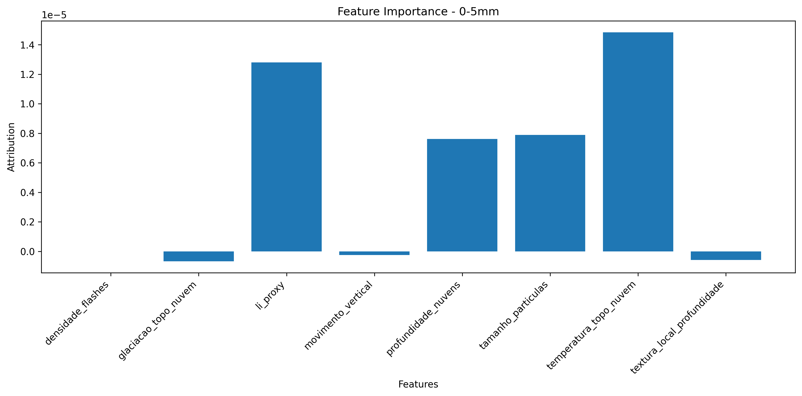

## Conclusão

Apesar da forte reutilização de código, este projeto apresenta contribuições inéditas e relevantes. A principal delas é a **integração com a biblioteca Captum** para análise de importância de features, uma implementação inédita no contexto do STConvS2S. Foram desenvolvidas também rotinas para **análise por faixas de precipitação**, permitindo uma avaliação mais granular do comportamento do modelo, e funções para **análise detalhada de amostras individuais**. Além disso, o projeto inclui a **extração automática de metadados** dos arquivos NetCDF para facilitar a interpretação dos resultados e **mecanismos de controle de amostragem** para equilibrar o custo computacional.
